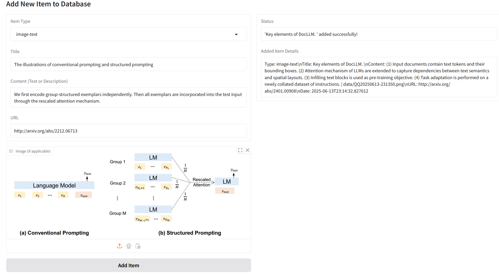
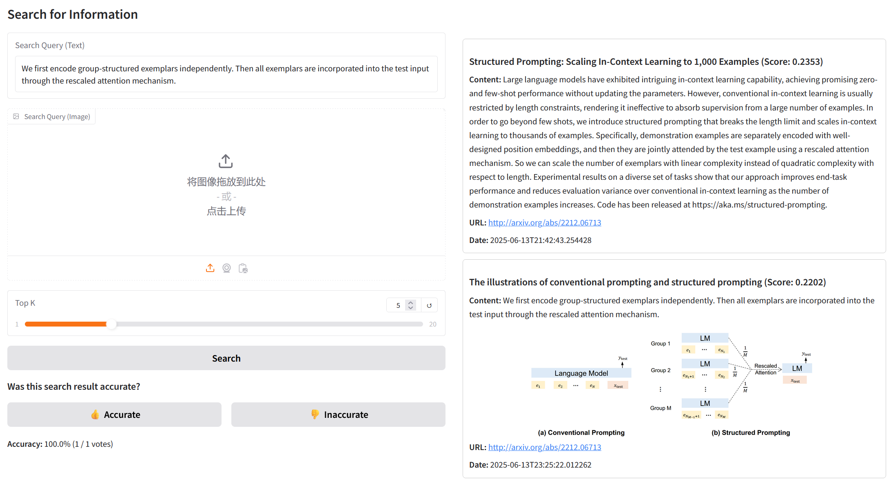
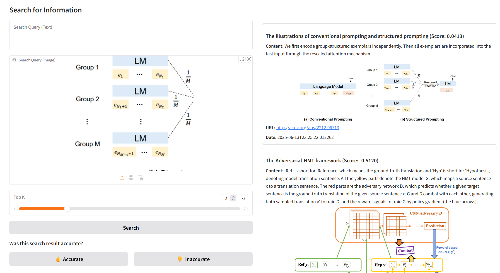

# 交互式多模态信息检索系统

这是一个基于GME-Qwen2-VL大型视觉语言模型构建的交互式多模态信息检索系统。它支持对文本、图像以及图文混合内容进行统一的语义检索。用户可以通过友好的Web界面添加和检索多模态数据。

## 主要功能

- **多模态数据管理**: 支持添加纯文本、纯图像和图文结合的数据到数据库。
- **多模态检索**: 支持使用文本、图像或图文组合作为查询条件。
- **可视化界面**: 基于 `Gradio` 构建，操作直观方便。
- **向量化检索**: 使用 `ChromaDB` 存储和检索由 `GME-Qwen2-VL` 模型生成的向量嵌入。
- **实时准确率评估**: 内置用户反馈功能，可对检索结果进行评估。

## 技术栈

- **核心模型**: `Alibaba-NLP/gme-Qwen2-VL-7B-Instruct`
- **后端框架**: `Gradio`, `PyTorch`, `Transformers`, `accelerate`
- **向量数据库**: `ChromaDB`

## 安装与配置

1.  **克隆仓库**
    ```bash
    # git clone <repository-url>
    # cd <repository-name>
    ```

2.  **创建虚拟环境并安装依赖**
    ```bash
    # 建议使用conda或venv创建虚拟环境
    # conda create -n rag_env python=3.10
    # conda activate rag_env
    pip install -r requirements.txt
    ```

3.  **硬件要求**
    - 本项目依赖 `GmeQwen2-VL-7B-Instruct` 模型，该模型参数量为70亿，推荐在高性能的NVIDIA GPU（例如 **A100 / A800**）上运行以获得最佳体验，如果在自己电脑上部署，可以使用 `GmeQwen2-VL-3B-Instruct`。
    - 请确保已正确安装NVIDIA驱动和CUDA Tookit。项目代码已使用 `float16` 半精度加载和 `accelerate` 库来优化资源占用。

## 如何使用

1.  **启动应用**
    在终端中运行以下命令：
    ```bash
    python app.py
    ```

2.  **访问界面**
    程序启动后，会输出一个本地URL (通常是 `http://127.0.0.1:10099` 或 `http://0.0.0.0:10099`)。在浏览器中打开此地址即可访问系统。

3.  **功能介绍**
    - **`Manage Data` (数据管理) 标签页**: 在此添加新的检索条目。选择类型（`text`, `image`, `image-text`），填写信息，上传图片（如果需要），然后点击 "Add Item"。
    - **`Search` (检索)** 标签页: 在此执行检索。输入文本查询，或上传图片查询，或两者都提供。点击 "Search" 按钮后，结果将显示在右侧。您可以点击下方的 "👍 Accurate" 或 "👎 Inaccurate" 按钮来评价结果。

## 项目结构
```
.
├── app.py                # Gradio Web应用入口
├── retriever.py          # 封装了GME-Qwen2-VL模型的检索逻辑
├── database.py           # 封装了ChromaDB数据库操作
├── requirements.txt      # 项目依赖
├── data/                 # (自动创建) 存储上传的原始图片
├── database/             # (自动创建) ChromaDB 持久化数据存储目录
└── README.md             # 本说明文件
```

## 演示效果







## 作者

- 唐梓楠 (2022211404)
- 连琎宇 (2022211394) 