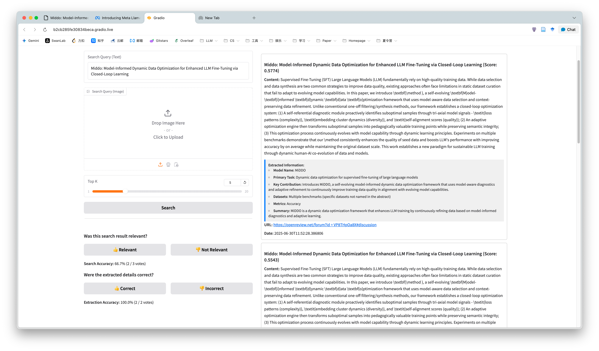

# 交互式多模态信息检索系统

这是一个基于GME-Qwen2-VL大型视觉语言模型构建的交互式多模态信息检索系统。它支持对文本、图像以及图文混合内容进行统一的语义检索，并集成了基于GPT-4o的智能信息抽取和多维度评估功能。

## 主要功能

- **多模态数据管理**: 支持添加纯文本、纯图像和图文结合的数据到数据库。
- **智能信息抽取**: 在数据入库时，自动调用GPT-4o模型，从AI论文摘要等内容中提取结构化的核心信息（如模型名称、关键贡献等）。
- **多模态检索**: 支持使用文本、图像或图文组合作为查询条件，返回图文并茂、并附带结构化信息卡片的结果。
- **可视化界面**: 基于 `Gradio` 构建，操作直观方便。
- **向量化检索**: 使用 `ChromaDB` 存储和检索由 `GME-Qwen2-VL` 模型生成的向量嵌入。
- **双维度准确率评估**: 内置用户反馈功能，可分别对**检索结果的相关性**和**抽取信息的准确性**进行评价。

## 近期更新 (v2.0)

本次重大更新为系统引入了"理解与分析"的能力，核心内容如下：

1.  **集成了基于GPT-4o的信息抽取功能**:
    -   **新增 `openai_extractor.py`**: 专门用于调用大模型API，内置了包含Schema验证和重试机制的健壮逻辑。
    -   **自动分析**: 现在，当您在"Manage Data"页面添加一篇AI论文的摘要时，系统会自动调用GPT-4o，抽取出如"模型名称"、"主要贡献"、"使用的数据集"等关键信息点。
    -   **结构化展示**: 在搜索结果中，每一条目下方都会以清晰的卡片形式，展示其被自动抽取的结构化信息，极大提升了信息获取效率。

2.  **新增了对信息抽取的评价体系**:
    -   在原有的"检索结果相关性"评价之外，新增了一套独立的评价体系，用于评估"抽取信息是否准确"。
    -   两个评价体系的数据分别持久化存储在 `search_feedback.json` 和 `extraction_feedback.json` 文件中，互不干扰。

3.  **增加了批量处理脚本**:
    -   **`import_data.py`**: 用于从一个大的JSON文件批量导入数据到系统中。
    -   **`backfill_data.py`**: 一个支持并发和强制刷新功能的强大脚本，用于为数据库中所有已存在的"老数据"追补和更新其信息抽取结果。

## 技术栈

- **核心模型**: `Alibaba-NLP/gme-Qwen2-VL-7B-Instruct`, `gpt-4o-latest`
- **后端框架**: `Gradio`, `PyTorch`, `Transformers`, `accelerate`
- **向量数据库**: `ChromaDB`
- **核心库**: `OpenAI`, `Pillow`, `Numpy`

## 安装与配置

1.  **克隆仓库**
    ```bash
    # git clone <repository-url>
    # cd <repository-name>
    ```

2.  **创建虚拟环境并安装依赖**
    ```bash
    # 建议使用conda或venv创建虚拟环境
    # conda create -n rag_env python=3.10
    # conda activate rag_env
    pip install -r requirements.txt
    ```

3.  **设置OpenAI API Key**
    信息抽取功能需要使用OpenAI的API。请在您的环境中设置环境变量：
    ```bash
    export OPENAI_API_KEY='your_openai_api_key'
    ```
    您也可以在 `app.py` 和 `backfill_data.py` 等文件的顶部直接修改API Key和Base URL。

4.  **硬件要求**
    - 本项目依赖 `GmeQwen2-VL-7B-Instruct` 模型，该模型参数量为70亿，推荐在高性能的NVIDIA GPU（例如 **A100 / A800**）上运行以获得最佳体验。

## 如何使用

1.  **启动应用**
    在终端中运行以下命令：
    ```bash
    python app.py
    ```

2.  **访问界面**
    程序启动后，会输出一个本地URL (通常是 `http://127.0.0.1:10099` 或 `http://0.0.0.0:10099`)。在浏览器中打开此地址即可访问系统。

3.  **功能介绍**
    - **`Manage Data`**: 添加新条目。系统会在后台自动为其提取结构化信息。
    - **`Search`**: 执行检索。结果将以图文和信息卡片的形式展示。在结果下方，您现在可以对"检索相关性"和"抽取准确性"进行双重评价。

## 项目结构
```
.
├── app.py # Gradio Web应用入口
├── retriever.py # 封装了GME-Qwen2-VL模型的检索逻辑
├── database.py # 封装了ChromaDB数据库操作
├── openai_extractor.py # 封装了调用GPT-4o进行信息抽取的逻辑
├── import_data.py # 批量导入数据的脚本
├── backfill_data.py # 为老数据追补信息抽取的脚本
├── requirements.txt # 项目依赖
├── data/ # (自动创建) 存储上传的原始图片
├── database/ # (自动创建) ChromaDB 持久化数据存储目录
├── search_feedback.json # (自动创建) 存储检索评价数据
├── extraction_feedback.json # (自动创建) 存储抽取评价数据
└── README.md # 本说明文件
```

## 演示效果




## 作者

- 唐梓楠 (2022211404)
- 连琎宇 (2022211394) 