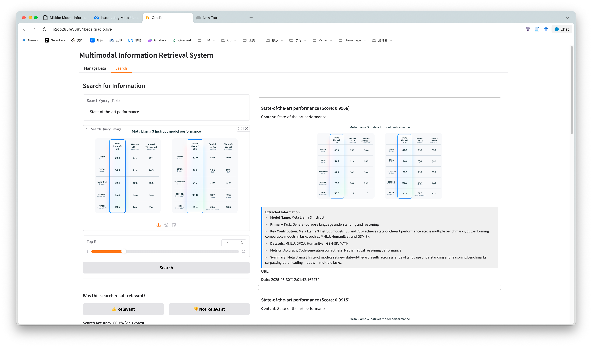
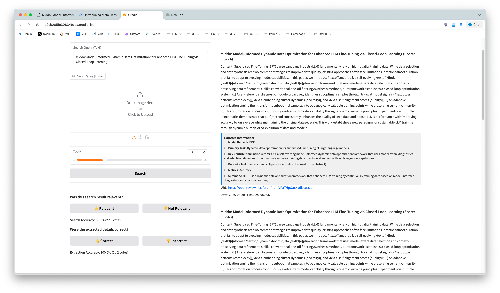

# 作业 3 报告：基于 GPT-4o 的高级信息抽取

**项目名称：** 交互式多模态信息检索系统之智能信息抽取模块

**作者：** 唐梓楠 2022211404、连琎宇 2022211394

**日期：** 2025-06-13

---

## 摘要

本项目在已有的多模态信息检索系统基础上，成功设计并集成了一个基于大型语言模型 GPT-4o 的高级信息抽取模块。该模块旨在从用户录入的 AI 及 LLM 相关论文摘要与配图中，自动、精准地提取结构化的核心信息。通过向 GPT-4o 提供精心设计的系统指令和 JSON Schema，我们实现了对模型名称、核心任务、主要贡献、数据集、评估指标等多个关键信息点的端到端抽取。抽取出的结构化信息与原始内容一同存入 ChromaDB 向量数据库，并在检索结果中以清晰、直观的卡片形式展示给用户。此功能的实现，不仅极大地丰富了系统的数据维度，更将系统的核心能力从"信息检索"提升到了"知识理解与分析"的更高层次，展现了前沿大模型在自动化知识构建领域的巨大潜力。

## 引言

在完成了多模态检索系统的基础框架后（见作业 2 报告），结合作业 3 的要求，我们认识到，一个现代化的信息系统不仅要能"找得到"，更要能"看得懂"。用户在检索到一篇相关论文后，往往需要花费额外的时间去阅读摘要，才能定位到其最关心的核心信息，如模型名称、关键贡献等。

为了解决这一痛点，本项目旨在开发一个智能信息抽取模块。其核心目标是利用大型语言模型（LLM）的强大自然语言理解能力，自动完成对非结构化文本（论文摘要）和视觉材料（图表）的分析，并将其转化为结构化的、机器和人类都易于阅读的知识卡片。这不仅能提升用户获取信息的效率，也为后续更复杂的知识图谱构建、数据分析等应用打下了坚实的基础。

## LLM 如何在向量空间中完成信息抽取

以 GPT-4o 为代表的大型语言模型（LLM）之所以能够颠覆传统的信息抽取（IE）流程，其根本原因在于它用一个统一的、基于 Transformer 架构的深层神经网络，替换了过去由多个独立模型构成的"管道"。其核心机制可从以下几个层面进行深入剖析：

### 从静态词嵌入到上下文感知的动态向量

传统 NLP 任务的起点通常是词嵌入（如 Word2Vec），每个词的向量是固定的。而 LLM 的基石——**Transformer 架构**，通过其核心的**自注意力机制（Self-Attention）**彻底改变了这一点。

对于输入的一段文本，首先会被切分为词元（Tokens）并映射为初始向量。随后，在模型的每一层中，自注意力机制都会为每个词元动态地计算一个全新的、富含上下文信息的向量。其简化过程如下：
-   每个词元的向量会生成三个不同的向量：**查询（Query）**、**键（Key）** 和 **值（Value）**。
-   对于某个词元（例如 "it"），它的 Query 向量会与句子中**所有**其他词元的 Key 向量进行点积运算，从而计算出一个**注意力分数（Attention Score）**。这个分数衡量了 "it" 应该对其他每个词元"关注"多少。
-   这些分数经过 Softmax 归一化后，被用作权重，去加权求和句子中所有词元的 Value 向量。
-   最终得到的这个加权和，就是该词元 "it" 在当前层、当前上下文中的全新向量表示。

经过多层堆叠的计算，最终输出的每个词元的向量都蕴含了整个输入序列的复杂句法、语义和指代关系。一个词（如 "bank"）在"river bank"和"investment bank"这两个不同语境下，其最终的输出向量将截然不同。**正是这种对上下文的深度编码能力，构成了所有高级自然语言理解任务的基础。**

### 语言学知识作为预训练的副产品

传统 IE 流程中的分句、命名实体识别（NER）、句法分析等任务，在 LLM 中并没有对应的独立模块。这些能力，被认为是模型在海量文本（数万亿词元）上进行"下一个词预测"这一简单的自监督预训练任务时，作为**副产品"涌现"（Emerge）**出来的。

为了准确地预测下一个词，模型必须在内部学习到：
-   **句法结构**：理解主谓宾、从句等结构，才能做出合乎语法的预测。
-   **实体概念**：必须知道 "Llama 3" 和 "BERT" 属于一类实体（模型名称），而 "ImageNet" 是另一类（数据集）。
-   **逻辑关系**：理解因果、并列、指代等关系。

因此，我们可以认为，一个预训练好的大型语言模型，其庞大的参数矩阵本身就是一个压缩的、分布式的**世界知识库和语言学知识库**。它已经隐式地完成了所有底层的语言学分析。

### 从分析到在激活空间中引导生成

当我们将信息抽取任务交给 GPT-4o 时，我们并非在命令它去"分析"文本，而是在**引导它的生成过程**。这个引导主要通过 Prompt Engineering 实现：

-   **System Prompt（系统提示）**：我们提供的指令，如 "You are an expert AI research assistant..."，其作用是在模型巨大的潜在"功能空间"中，激活与"科研助理"、"信息分析"相关的神经网络通路，抑制无关通路。这可以看作是为后续的计算设定了一个**初始上下文（Initial Context）或先验（Prior）**。
-   **JSON Schema（输出格式约束）**：这是最精妙的一步。当我们要求模型以特定的 JSON 格式输出时，我们实质上是在模型的**输出概率分布（Output Probability Distribution）**上施加了一个强大的约束。在生成每个词元时，模型不再是自由地从整个词汇表中选择，而是被限制在一个**"合法词元"的子集**中——即那些能够构成一个有效 JSON 结构（如 `{`, `"`, `}` 等）并符合我们预设 Schema 的词元。

因此，整个信息抽取过程可以被理解为：模型首先在其内部的、高维的激活空间中对输入文本进行深度语义理解，形成一个富含信息的"思想状态"。然后，在生成输出时，我们的 Prompt 和 Schema 就像是轨道，引导这个"思想状态"以一种结构化的、确定性的方式"坍缩"成我们想要的 JSON 字符串。

### 多模态的向量空间对齐

对于 GPT-4o 这样的多模态模型，其原理是相似的，但增加了一个关键步骤：**视觉信息向量化与对齐**。
-   **视觉编码器（Visual Encoder）**: 输入的图片首先会经过一个独立的、类似 ViT (Vision Transformer) 的编码器，被转换成一系列代表了图片不同区域特征的**视觉向量（Visual Embeddings）**。
-   **跨模态注意力（Cross-Attention）**: 这些视觉向量随后会被送入主模型的解码器中。在特定的跨模态注意力层里，文本词元的 Query 向量会与视觉向量的 Key 和 Value 进行交互。这使得文本词元可以"看到"图片内容，从而在生成最终输出时，能够融合来自两个模态的信息。

这套机制保证了模型在处理图文输入时，不仅仅是简单地"看图说话"，而是能够进行深度的语义对齐和逻辑推理，为实现真正意义上的多媒体信息抽取提供了可能。

## 系统实现与成果展示

### 核心模块实现

本功能的实现主要依赖于新建的 `openai_extractor.py` 模块，并对原有的 `database.py` 和 `app.py` 进行了扩展。

-   **`openai_extractor.py`**: 这是信息抽取的大脑。我们定义了一个详尽的 `JSON_SCHEMA`，它规定了需要抽取的六个关键信息点（模型名称、主要任务、关键贡献、数据集、评估指标、单句总结）及其格式。核心函数 `extract_information` 负责构建包含了系统指令、用户输入（文本和可选的Base64编码图片）的 Prompt，并调用 GPT-4o API，同时利用其 `response_format` 功能强制其返回符合我们预设 Schema 的 JSON 对象。此外，该模块还集成了 API Key 管理、多URL支持和重试机制，保证了调用的健壮性。

-   **`database.py`**: 我们对 `Database` 类的 `add` 方法进行了扩展，增加了一个 `extracted_info` 字段。这样，从 GPT-4o 获取的 JSON 字符串就可以和向量、标题等元数据一同存入 ChromaDB 中。

-   **`app.py`**: 这是功能集成的终点。
    -   在 `add_item` 函数的工作流中，在数据被存入数据库前，会先调用 `extract_information` 函数。
    -   新增了 `format_extracted_info_html` 函数，它负责将存储的 JSON 字符串解析并渲染成一个美观的 HTML 卡片。
    -   在 `search_items` 函数中，展示每一条检索结果时，都会调用上述格式化函数，将抽取出的信息卡片附加在原始内容的下方。

### 成果展示

通过上述实现，我们的系统现在具备了强大的"边添加边分析"的能力。

**当用户在"Manage Data"界面添加一篇新的论文摘要时，系统后台会自动完成以下操作：**
1.  为摘要内容生成检索用的向量。
2.  将摘要文本（和配图）发送给 GPT-4o 进行信息抽取。
3.  将原始信息、向量以及抽取出的结构化 JSON 一同存入数据库。

**当用户在"Search"界面检索并得到结果时，界面会呈现如下效果：**

> **[论文标题] (Score: 0.85)**
>
> **Content:** [这里是原始的论文摘要内容...]
>
> ---
> **Extracted Information:**
> *   **Model Name:** Llama 3
> *   **Primary Task:** Text Generation, Few-shot Learning
> *   **Key Contribution:** Improved pre-training data mixture and scaling laws for LLMs.
> *   **Datasets:** A new 15T token dataset.
> *   **Metrics:** MMLU
> *   **Summary:** Llama 3 significantly improves model performance on benchmarks like MMLU through better data and scaling.
> ---
>
> **URL:** [http://example.com/paper-url]
> **Date:** [2025-06-13]

**具体示例：**

假设我们添加以下内容：
-   **Title:** "Introducing Llama 3"
-   **Content:** "We introduce Llama 3, a new family of large language models. Our work focuses on improving pre-training data and scaling laws. We trained on a new 15T token dataset and evaluated on the MMLU benchmark, achieving a score of 82.0. This represents a significant improvement in model performance for few-shot learning scenarios."

系统在存储这条记录时，会自动调用 `extract_information`，并得到类似如下的 JSON 对象，该对象将被一同存入数据库的元数据中：
```json
{
  "model_name": "Llama 3",
  "primary_task": "Large Language Model Development",
  "key_contribution": "Improving pre-training data and scaling laws to enhance model performance.",
  "datasets_used": [
    "A new 15T token dataset"
  ],
  "evaluation_metrics": [
    "MMLU"
  ],
  "one_sentence_summary": "Llama 3 is a new large language model that achieves significantly improved performance through enhanced pre-training data and scaling strategies."
}
```
这个 JSON 对象随后会被格式化，并如上所示地展示在检索结果中。





## 创新性思考与优化

### 链式思考与自我修正
当前的信息抽取是一次性的。为了追求更高的准确率，我们可以设计更复杂的智能体（Agent）工作流：
-   **链式抽取（Chain-of-Thought）**: 第一步让 GPT-4o 先对摘要生成一个简短的总结，第二步再让它根据这个总结和原始文本来填充 JSON。这种"先理解，再抽取"的链式过程能有效提升对复杂文本的处理能力。
-   **自我修正（Self-Correction）**: 在得到抽取的 JSON 后，可以发起第二次 API 调用，指令变为："你是一名严谨的审查员，请判断这份抽取出的信息是否完全忠实于原文，并修正任何不准确之处。" 这构成了一个反馈闭环，能有效减少模型的"幻觉"现象。

### 成本与效率优化 (RAG思想)
直接为每一条数据调用 GPT-4o 成本较高。我们可以引入分层处理机制：
-   **快速初筛**: 使用一个本地运行的小模型（如 `BERT`）或关键词匹配，对文本进行快速分析，判断其是否为"高信息密度"的论文摘要。
-   **精细处理**: 只有通过初筛的文本，才调用昂贵的 GPT-4o API 进行精细的结构化抽取。这能以较低的成本，处理海量数据。

## 总结

本次作业的成功实现，标志着我们的项目从一个单纯的信息检索工具，演进为了一个具备初步知识理解和分析能力的智能系统。通过将 GPT-4o 的强大生成和理解能力与我们现有的检索框架相结合，我们不仅极大地提升了用户获取信息的效率和深度，也为未来构建更复杂的知识图谱、智能问答等高级应用打下了坚实的基础。这次实践深刻地展示了大型AI模型在自动化知识工程领域的巨大潜力和价值